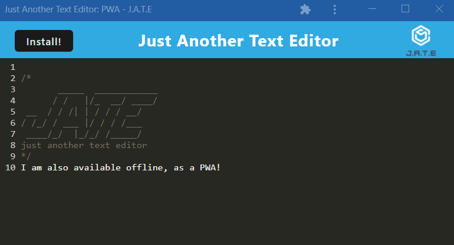

# JATE Just Another Text Editor Progressive Web App

## Description

This project is a text editor using webpack, indexedDB, and is built as a progessive web application. When the user runs the application from the deployed link, they are able to edit text on the application, and the text that they edit is saved via indexedDB. The user is also able to download the application as a progressive web application for offline use.

---

## Table of Contents

- [Usage](#usage)
- [Screenshots](#screenshots)
- [License](#license)
- [Questions](#questions)

---

## Usage

Visit the deployed application at [aav-jate.herokuapp.com](https://aav-jate.herokuapp.com/).

The application is able to be saved for offline use as a progressive web application by either clicking the Install button, or by using the install button on the browser itself. To use the application, click into the text lines and type desired text.

---

## Screenshots

Screenshots of the deployed application are below.

### Application as hosted on Heroku

### Application as installed as a PWA

---

## License

This project is licensed under a [MIT License](https://opensource.org/licenses/MIT).

---

## Questions

Check out my [GitHub profile](https://github.com/aavillanueva6).

For additional questions about this project, please reach out to me at <aavillanueva6@gmail.com>
